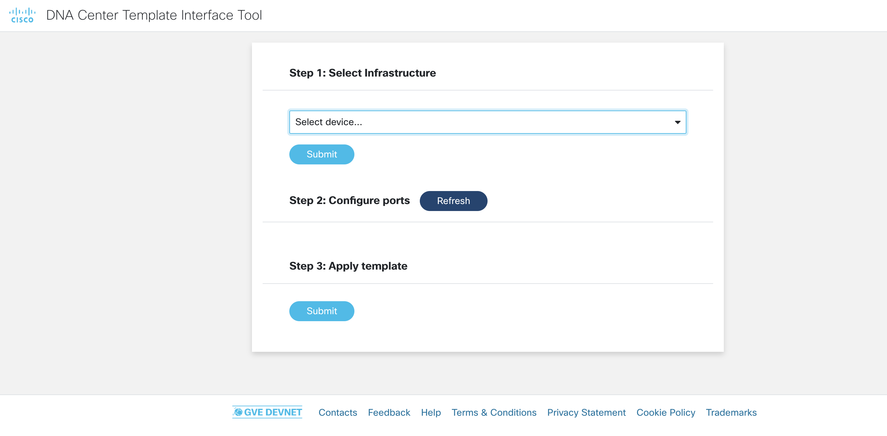

# GVE DevNet DNA Center Interface Tool
This prototype facilitates easy interaction with DNA Center templates for switch port configuration. The user first selects the device they want to configure, then they choose the interface template they want to apply for each port on that switch, and finally submit their choices. The tool then interacts with DNA Center over its REST APIs to deploy the chosen templates to their corresponding infrastructure. For this prototype, the interface templates applied are related to authentication mechanisms. However, this is merely a starting point for other applications of the same concept. 

## Contacts
* Stien Vanderhallen (stienvan@cisco.com)

## High-level Overview


## Solution Components
* Flask
* Python
* DNA Center

## Prerequisite: DNA Center configuration template

As a prerequisite, you will need to configure a DNA Center configuration template suitable to interact with this prototype. The following steps are to be executed in your DNA Center dashboard. 

1. In the sidebar menu, select `Tools > Template Editor`


2. In the top left, click `+` and then click `Create template` to create a new template


3. Fill out the corresponding form with a `name`, `description`, `project`, and `tags` suitable to you. Select `Switches and Hubs` as the `device type`


4. Click `Add`

5. In the template editor, fill out the template configuration containing an interface template configuration as follows (using your own specific commands within the interface templates):

``` jinja
template DefaultWiredDot1xClosedAuth
 description -- Dot1x - Static configuration from Cisco DNA Center --
 <your-config-for-dot1x-ports>
!
template DefaultPrinter
 description -- Printer - Static configuration from Cisco DNA Center --
 <your-config-for-printer-ports>
!
template DefaultCollaboration
 description -- Collaboration - Static configuration from Cisco DNA Center --
 <your-config-for-collaboration-ports>
!


  interface {{ accessInterface }}
  source template DefaultWiredDot1xClosedAuth
  no shutdown

!

  interface {{ accessInterface }}
  source template DefaultPrinter
  no shutdown

!

  interface {{ accessInterface }}
  source template DefaultCollaboration
  no shutdown

```

## Installation

Execute the below commands in your terminal. 

1.	Choose a folder, then create and activate a virtual environment for the project
    ```python
    # WINDOWS:
    $ py -3 -m venv [add name of virtual environment here] 
    source [add name of virtual environment here]/Scripts/activate
    # MAC:
    $ python3 -m venv [add name of virtual environment here] 
    $ source [add name of virtual environment here]/bin/activate
    ```

2. Access the created virtual enviroment folder
    ```
    $ cd [add name of virtual environment here] 
    ```

3.	Clone this Github repository into the virtual environment folder.
    ```
    $ git clone wwww.github.com/gve-sw/gve_devnet_dnac_template_interface
    ```

4. Access the folder **gve_devnet_dnac_template_interface**
    ```
    $ cd gve_devnet_dnac_template_interface
    ```

5.	Install dependencies
    ```python
    $ pip3 install -r requirements.txt
    ```

6. In `.env`, fill in the following details:
- `DNAC_HOST`: The IP address of your DNAC instance
- `DNAC_USER`: The username for your DNAC instance
- `DNAC_PASS`: The password for your DNAC instance
- `TEMPLATE_NAME`: The `name` for the DNAC template as you configured under the `Prerequisite` section above

7. Run the application
    ```
    $ python3 app.py
    ```
8. In a browser, navigate to `localhost:8756`

## Workflow

0. The landing page of the prototype



1. Select the device you want to configure


2. Click `Submit` to see a list of ports on the selected device


3. For each port, select the interface template you want to configure.


4. Click `Submit` to apply the interface templates as selected. 


### LICENSE

Provided under Cisco Sample Code License, for details see [LICENSE](LICENSE.md)

### CODE_OF_CONDUCT

Our code of conduct is available [here](CODE_OF_CONDUCT.md)

### CONTRIBUTING

See our contributing guidelines [here](CONTRIBUTING.md)

#### DISCLAIMER:
<b>Please note:</b> This script is meant for demo purposes only. All tools/ scripts in this repo are released for use "AS IS" without any warranties of any kind, including, but not limited to their installation, use, or performance. Any use of these scripts and tools is at your own risk. There is no guarantee that they have been through thorough testing in a comparable environment and we are not responsible for any damage or data loss incurred with their use.
You are responsible for reviewing and testing any scripts you run thoroughly before use in any non-testing environment.
